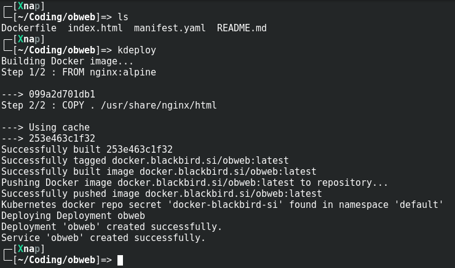

# kdeploy
Deploy tool that deploys your applicaton to your kubernetes cluster without the need for thinking and figuring out deploy process. kdeploy uses Python and Kubernetes along with Docker libs to:

- Build image
- Push image to your repository
- Generate appropriate kubernetes config for it
- Deploy it to your kubernetes cluster

Idea is, to just have a short `manifest.yaml` file that describes how you want your app to be deployed and run `kdeploy` which should take care of everything for you. Perfect for home development and when you don't want to deal with fixing all the scripts that will perform deploy for you.

## Example

I have small obweb app, that consists of index.html and a Dockerfile that  runs nginx to serve this index.html.

Dockerfile:
```
FROM nginx:alpine
COPY . /usr/share/nginx/html
```

index.html
```
Hello world!
```

So what I need to do is just write a small `manifest.yaml` file. I want this to be a **Deployment** type in kubernetes and it should have a **Service**  linked, that exposes port 80. To achieve this, I would just put this into my `manifest.yaml`:

```
docker_repo: docker.blackbird.si
docker_repo_label: docker-blackbird-si
app_name: obweb
app_version: latest
kubernetes:
    kind: Deployment
    replicas: 1
    ports:
        - 80: 80
```

### Explanation
What this does is, it sets docker repo that you want image to go, link docker label secret that you have in your kubernetes cluster and allows access to this repository. Next you name the app and specify app version that you want deployed. Last but not least, you set what kind of resource you want this to be. If you add **ports** to **kubernetes** section, it will also create a **Service** with same name as app and link it to  **Deployment**.

### Deploy

What you need to do next, once you have `manifest.yaml` in your folder where Dockerfile is, you just call `kdeploy` and it will do the rest:



# Requirements
# Installation
# Usage